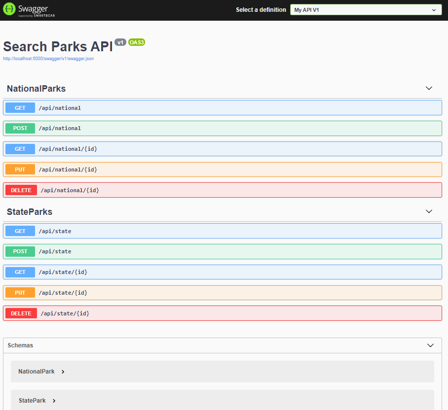

# **Parks Lookup**
By _Olha Hizhytska_

## Description
An API web application allows user to see the list of national and state parks, check the addres and wether wheelchair access is available. This application is built utilizing C# ASP.NET Core, its ORM Entity, MySQL Database (and Workbench), RESTful principles and Swagger. The user is able to see the in-use version of the API when using Postman/Swagger.

## Technologies Used:

* C#
* .NET 5
* ASP.NET Core MVC
* Entity Framework Core
* ASP.NET Identity 
* MySQL
* MySQL Workbench
* Postman
* HTTP
* RESTful
* Swagger/Open API

## Installation Requirements (see install instructions below)
* C# .NET 5
* MySQL & MySQL Workbench
* Swagger 


<details>
  <summary>Expand Installation</summary>

#### <span style="color:#c4f4ef">Mac</span> 
1. Download the MySQL Community Server .dmg file from the [MySQL Community Server page](https://dev.mysql.com/downloads/file/?id=484914). Click the download icon. Use the "No thanks, just start my download link."
2. Follow along with the Installer until you reach the Configuration page. Once you've reached Configuration, select or set the following options (use default if not specified):
    * Use Legacy Password Encryption.
    * Set password to "epicodus".
    * Click Finish.
    * Open the terminal and enter the command echo 'export PATH="/usr/local/mysql/bin:$PATH"' >> ~/.bash_profile. This will save this path in .bash_profile, which is where our terminal is configured.
    * Type in source ~/.bash_profile (or restart the terminal) in order to actually verify that MySQL was installed.
3. Verify MySQL installation by opening terminal and entering the command mysql -uroot -pepicodus. You'll know it's working and connected if you gain access and see the MySQL command line. If it's not working, you'll likely get a -bash: mysql: command not found error.
4. You can exit the mysql program by entering exit.
5. Download the MySQL Workbench .dmg file from the [MySQL Workbench page](https://dev.mysql.com/downloads/file/?id=484391). Use the "No thanks, just start my download link".
6. Install MySQL Workbench to Applications folder.
7. Open MySQL Workbench and select the Local instance 3306 server. You will need to enter the password "epicodus". If it connects, you're all set.

#### <span style="color:#c4f4ef">Windows</span> 
1. Download the MySQL Web Installer from the [MySQL Downloads page](https://dev.mysql.com/downloads/file/?id=484919). Use the "No thanks, just start my download link".
2. Follow along with the installer:
    * Click "Yes" if prompted to update.
    * Accept license terms.
    * Choose Custom setup type.
    * When prompted to Select Products and Features, choose the following:
        * MySQL Server 8.0.19 (This will be under "MySQL Servers > MySQL Server > MySQL Server 8.0")
        * MySQL Workbench 8.0.19 (This will be under "Applications > MySQL Workbench > MySQL Workbench 8.0")
    * Select "Next", then "Execute". Wait for download and installation. (This can take a few minutes.)
    * Advance through Configuration as follows:
        * High Availability set to "Standalone".
        * "Defaults are OK" under Type and Networking.
        * Authentication Method set to Use Legacy Authentication Method.
        * Set password to "epicodus". 
        * Defaults are OK under Windows Service. Make sure that checkboxes are checked for the options "Configure MySQL Server as a Windows Service" and "Start the MySQL Server at System Startup". Under Run Windows Service as..., the "Standard System Account" should be selected.
    * Complete Installation process.
3. Add the MySQL environment variable to the System PATH. You must include MySQL in the System Environment Path Variable. This is its own multi-step process:
    * Open the Control Panel and visit System and "Security > System". Select "Change Settings" and a pop-up window will display. Select the tab "Advanced" and select the "Environment Variables" button.
    * Within the System Variables navigator window, select PATH..., click Edit..., and then New.
    * Add the exact location of your MySQL installation, and click OK. (This location is likely C:\Program Files\MySQL\MySQL Server 8.0\bin, but may differ depending on your specific installation.)
4. Verify installation by opening Windows PowerShell and entering the command mysql -uroot -pepicodus. You'll know it's working and connected if you gain access and see MySQL's command line. You can exit the mysql program by entering exit.
5. Open MySQL Workbench and select the Local instance 3306 server (it may have a different name). You will need to enter the password "epicodus". If it connects, you're all set.

</details>

## Installation .NET 5. 

Please follow this steps:
 - Download [.NET 5 SDK (Software Development Kit)](https://https://dotnet.microsoft.com/download/dotnet/thank-you/sdk-5.0.100-macos-x64-installer). Clicking this link will prompt a file download for your particular OS from Microsoft.
 - Open the file. Follow the installation steps.
 - Confirm the installation is successful by opening your terminal and running the command $ dotnet --version. You should see something like this in response: 5.0.100. This means .NET was successfully installed.
 
## For Mac & Windows Operating Systems

- Install dotnet script with the following terminal command  `dotnet tool install -g dotnet-script`.

## Setup

#### To open this application:

- Clone this repository to your desktop, using next command:

  git clone https://github.com/OlgaHi/Parks-Lookup.Solution.git

- Navigate to the top level of the directory.

  cd Parks-Lookup.Solution

#### .NET Core Commands:
 - Navigate to the /ParksSearch folder
 - Run the following command: dotnet restore
 - Run the following command: dotnet build
 - Run the following command to execute this compiled code: dotnet run
 - In browser navigate to http://localhost:5000


- To start using SQL:
  - Open terminal and run this command: ```mysql -u[UserName] -p[Password]```.

- Then, you need to create appsettings.json
 -  Create file ```appsettings.json``` in ```/ParkSearch/```.
 -  Copy into appsettings.json, replacing username and password with your sql database details.
```
{
    "Logging": {
        "LogLevel": {
            "Default": "Warning"
        }
    },
    "AllowedHosts": "*",
    "ConnectionStrings": {
      "DefaultConnection": "Server=localhost;Port=3306;database=[YourDatabaseName];uid=[YourUserAccount];pwd=[YourPassword];"
  }
}
```

Import Database Structure with Entity Framework Core

 - Navigate to the /ParksSearch directory in your terminal.
 - To use the mirgrations folder to create the MySQL Database using Entity Framework Core run the command: dotnet ef database update 
 - (OPTIONAL) If you need to make adjustments to the database, use the command: dotnet ef migrations add [NameOfNewMigration] 
 - To update your database run: dotnet ef database update

### API Documentation

Feel free to explore the API endpoints in [Postman](https://www.postman.com/downloads/).
Base URL: `http://localhost:5000`


### Accessing the SwaggerUI

Launch the project from the /ParksSearch project folder by typing `dotnet run` into the terminal. Input `http://localhost:5000/swagger` to view and interact with the Swashbuckle SwaggerUI.

### HTTP Request Structure

```
GET /api/{value}
POST /api/{value}
GET /api/{value}/{id}
PUT /api/{value}/{id}
DELETE /api/{value}/{id}
```



#### Example Query

`https://localhost:5000/api/national/2`

#### Sample JSON Response

```
{
  "id": 2,
  "name": "Mountain Rainier Park",
  "address": "55210 238th Avenue East, Ashford, WA",
  "wheelchairAccess": false
}
```
<details>

<summary>State Parks. Expand to access information about a state park</summary>

### HTTP Request

```
GET /api/states
GET api/states/state?name={name}
POST /api/states
GET /api/states/{id}
PUT /api/states/{id}
DELETE /api/states/{id}
```

#### Path Parameters

| Parameter         | Type    | Default | Required | Description                        | Example                   |
| ----------------- | ------  | ------- | -------- | ---------------------------------- | --------------------------|
| name              | string  | none    | true     | Return matches by state park name. | name=Saint Edward        |
| wheelchairAccess  | boolean | none    | true     | Return matches by wheelchairAccess | wheelchairAccess=true     |

#### Example Query

1. `http://localhost:5000/api/state?name=Saint%20Edward&wheelchairAccess=true`
2. `http://localhost:5000/api/state?name=Saint%20Edward`

#### Sample JSON Response

1.

```
{
    "id": 2,
    "name": "Saint Edward",
    "address": "555 NE, Kenmore, WA",
    "wheelchairAccess": true
  }

```
2.

```
[
  {
    "id": 1,
    "name": "Bridle Trails",
    "address": "5300 116th Ave NE, Kirkland, WA",
    "wheelchairAccess": true
  },
  {
    "id": 2,
    "name": "Saint Edward",
    "address": "555 NE, Kenmore, WA",
    "wheelchairAccess": true
  },
  {
    "id": 3,
    "name": "Kitsap Memorial",
    "address": "1111 NE 136 St, Poulsbo, WA",
    "wheelchairAccess": true
  }
]

```
</details>

<details>

<summary> National Parks.  Expand to access information about a national park</summary>

#### HTTP Request

```
GET /api/nationals
GET api/nationals/national?name={name}
POST /api/nationals
GET /api/nationals/{id}
PUT /api/nationals/{id}
DELETE /api/nationals/{id}
```

#### Path Parameters

| Parameter            | Type   | Default | Required | Description                           | Example                                     |
| -------------------- | ------ | ------- | -------- | ------------------------------------- | ------------------------------------------  |
| name                 | string | none    | true     | Return matches by national park name. | name=Olympic Park                           |
| address              | string | none    | true     | Return matches by parks address       | address=3002 Mt Angeles Rd, Port Angeles, WA|

#### Example Query

1. `http://localhost:5000/api/national?name=Olympic%20Park`
2. `http://localhost:5000/api/national?address=3002%20Mt%20Angeles%20Rd%2C%20Port%20Angeles%2C%20WA`

#### Sample JSON Response

1.

```
{
    "id": 1,
    "name": "Olympic Park",
    "address": "3002 Mt Angeles Rd, Port Angeles, WA",
    "wheelchairAccess": true
  }
```
</details>


### API Setup References

[ASP.NET Core web API documentation with Swagger / OpenAPI](https://docs.microsoft.com/en-us/aspnet/core/tutorials/web-api-help-pages-using-swagger?view=aspnetcore-5.0)
[Swashbuckle and ASP.NET Core](https://docs.microsoft.com/en-us/aspnet/core/tutorials/getting-started-with-swashbuckle?view=aspnetcore-5.0&tabs=visual-studio)
[Swashbuckle Getting Started](https://github.com/domaindrivendev/Swashbuckle.AspNetCore/blob/master/README.md)
[Swashbuckle.AspNetCore REAMDE](https://github.com/domaindrivendev/Swashbuckle.AspNetCore#swashbuckleaspnetcoreswaggerui)

## Known Bugs

- No known issues

## License

[MIT](https://en.wikipedia.org/wiki/MIT_License)
Copyright (c) 2021 _Olha Hizhytska_

## Contact Information

- Olha Hizhytska olgainfotech@gmail.com